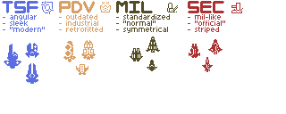

# Faction Ship Design

## What is this?

Those are the mapping guidelines dedicated to general design of ships of specific factions. They are more loose, but should be followed along with the standard ship guidelines.

## TSF Ship Design
#### Technology and design
- Higher-tech feel and general technology level - near-future advanced navy vibe.
- Tech is generally TSF-original.
- Ships that like to fly closer to the enemy and brawl while dodging, but will succumb to pressure once breached.
#### Weaponry
- Prefers energy weapons, some EMP, and fast-firing ballistics. Generally shorter range.
- Armament is almost entirely forward-focused, with few side and almost none, if any, backward firing arcs. Rare broadside ships.
#### Internals
- Centralized core systems
- Effective information technology (radar, elint, etc) and advanced FTL drives/shields
- Efficient, high tech power generation (Pinch, etc., as opposed to AME or similar).
#### Defense and mobility
- Less dense armor (not bricks) - reliance on shields
- Good speed and maneuverability in general.

## PDV Ship Design
#### Technology and design
- Outdated feel, with ships being largely repurposed industrial rigs.
- Rare or research-locked ships may have reverse-engineered high tech, like TSF ships.
#### Weaponry
- Prefers punchy lower-firerate ballistics and missiles. Common long-range weaponry.
- Spread-out armament with significant firing arc coverage. Common broadside ships.
#### Internals
- Multiple redundant or backup systems, such as supply rooms, backup power generation (can include solar panel crates with solar control console flatpack), redundant wiring, or a second bridge on large vessels.
- Hull may have metal foam modules to automatically vacuum-seal itself on damage.
- Little, but some, flavor rooms.
- Almost no shields - reliance on raw armor
#### Defense and mobility
- Good internal armor.
- Moderate to high armor depending on ship class, distributed across the whole exterior.
- Slow movement.

## Visual guide
